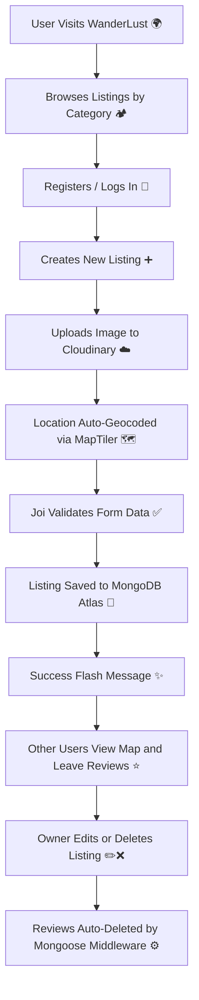

# 🌍 WanderLust — ExploreEase

> ⚡ **WanderLust** is a full-stack travel listing web app inspired by Airbnb, built using **Node.js**, **Express**, **MongoDB**, and **EJS**. It lets users explore, create, and review travel destinations with full authentication, authorization, interactive maps, and cloud-based image uploads. ✈️🏕️

---

## 🚀 Tech Stack


---

## ⚙️ Key Features

| Feature | Description |
|---|---|
| 🧾 **CRUD Operations** | Users can Create, Read, Update, and Delete listings and reviews. |
| 🔐 **Authentication** | Secure login & signup using Passport.js with encrypted MongoDB sessions. |
| 🛡️ **Authorization** | Only owners or admins can modify or delete their listings or reviews. |
| 💬 **Flash Messages** | Real-time success and failure feedback with connect-flash. |
| 🧮 **Validations** | Server-side using Joi; client-side with Bootstrap's validation API. |
| 🧩 **MVC Architecture** | Clean separation of concerns — Models, Views, Controllers. |
| ⚙️ **Middlewares** | Custom auth guards, ownership checks, and error-handling middlewares. |
| 🗂️ **Category Filters** | Filter listings by Rooms, Mountains, Castles, Beaches, Deserts, Arctic & more. |
| 🔍 **Search** | Search listings by title or destination. |
| ☁️ **Cloud Integration** | Cloudinary for image hosting with Multer for file uploads. |
| 🗺️ **Map Integration** | MapLibre GL + MapTiler for interactive maps with auto-geocoded location pins. |
| 💰 **Tax Toggle** | Show/hide +18% GST on listing prices. |

---

## 📁 Project Structure

```
WanderLust-exploreEase/
├── controllers/
│   ├── listings.js          # Listing logic + MapTiler geocoding
│   ├── reviews.js           # Review create/delete
│   └── users.js             # Auth flow (signup, login, logout)
├── init/
│   ├── data.js              # Sample seed data
│   └── index.js             # DB seeding script
├── models/
│   ├── listing.js           # Listing schema (with cascade delete)
│   ├── review.js            # Review schema
│   └── user.js              # User schema (passport-local-mongoose)
├── public/
│   ├── css/
│   │   ├── rating.css       # Starability star rating UI
│   │   └── style.css        # Global custom styles
│   └── js/
│       ├── map.js           # MapLibre GL map initialization
│       └── script.js        # Bootstrap form validation
├── routes/
│   ├── listing.js           # /listings CRUD routes
│   ├── review.js            # /listings/:id/reviews routes
│   └── user.js              # /signup, /login, /logout
├── utils/
│   ├── ExpressError.js      # Custom error class
│   └── wrapAsync.js         # Async error wrapper
├── views/
│   ├── includes/
│   │   ├── flash.ejs        # Flash message partial
│   │   ├── navbar.ejs       # Sticky navbar with search
│   │   └── footer.ejs
│   ├── layouts/
│   │   └── boilerplate.ejs  # Master HTML layout
│   ├── listings/
│   │   ├── index.ejs        # Listings grid + category filters
│   │   ├── show.ejs         # Listing detail + map + reviews
│   │   ├── new.ejs          # Create listing form
│   │   ├── edit.ejs         # Edit listing form
│   │   └── searchResults.ejs
│   ├── users/
│   │   ├── login.ejs
│   │   └── signup.ejs
│   └── error.ejs
├── cloudConfig.js           # Cloudinary + Multer storage config
├── middleware.js            # Auth, ownership & validation guards
├── schema.js                # Joi validation schemas
├── app.js                   # Express entry point
├── package.json
└── README.md
```

---

## 🔁 How It Works — Application Workflow



---

## 🧰 Installation & Setup

### 1. Clone the repository

```bash
git clone https://github.com/your-username/WanderLust-exploreEase.git
cd WanderLust-exploreEase
```

### 2. Install dependencies

```bash
npm install
```

### 3. Environment variables

Create a `.env` file in the root with:

```env
# MongoDB Atlas connection string
ATLASDB_URL=mongodb+srv://<username>:<password>@cluster0.xxxxx.mongodb.net/?appName=Cluster0

# Session secret (any long random string)
SECRET=your_random_secret_here

# Cloudinary credentials
CLOUD_NAME=your_cloudinary_cloud_name
CLOUD_API_KEY=your_cloudinary_api_key
CLOUD_API_SECRET=your_cloudinary_api_secret

# MapTiler API key (maps + geocoding)
MAPTILER_KEY=your_maptiler_api_key
```

### 4. Seed the database *(optional)*

```bash
node init/index.js
```

### 5. Run the app

```bash
node app.js
```

### 6. Visit the app

👉 **http://localhost:8080**

---

## 🚦 Core API Routes

### Listings

| Method | Route | Auth | Description |
|---|---|---|---|
| GET | `/listings` | — | All listings |
| GET | `/listings/:id` | — | Single listing detail + map |
| GET | `/listings/new` | New listing form |
| POST | `/listings` | Create listing |
| GET | `/listings/:id/edit` | Owner/Admin | Edit listing form |
| PUT | `/listings/:id` | Owner/Admin | Update listing |
| DELETE | `/listings/:id` | Owner/Admin | Delete listing |
| GET | `/listings/category/:cat` | — | Filter by category |

### Reviews

| Method | Route | Auth | Description |
|---|---|---|---|
| POST | `/listings/:id/reviews` | Add a review |
| DELETE | `/listings/:id/reviews/:reviewId` | Author | Delete a review |

### Users

| Method | Route | Description |
|---|---|---|
| GET/POST | `/signup` | Register a new account |
| GET/POST | `/login` | Log in |
| GET | `/logout` | Log out |
| GET | `/search?q=` | Search listings by title |

---

## 🗂️ Listing Categories

`Rooms` · `Iconic Cities` · `Mountains` · `Castles` · `Amazing Pools` · `Camping` · `Beach` · `Deserts` · `Arctic`

---

## 🚀 Deployment

Recommended deployment stack:

| Service | Purpose |
|---|---|
| **Render** | Backend hosting |
| **MongoDB Atlas** | Cloud database |
| **Cloudinary** | Image storage |
| **MapTiler Cloud** | Maps & geocoding |

---

## 🤝 Contributing

Contributions, issues, and feature requests are welcome!
Feel free to fork this repo and submit a Pull Request.

### 🔧 How to Contribute

1. **Fork** the repository
2. **Clone** your fork
   ```bash
   git clone https://github.com/your-username/WanderLust-exploreEase.git
   ```
3. **Create** a new branch
   ```bash
   git checkout -b feature-name
   ```
4. **Make** your changes
5. **Commit** your updates
   ```bash
   git commit -m "Add: your feature name"
   ```
6. **Push** the branch
   ```bash
   git push origin feature-name
   ```
7. **Open a Pull Request** 🚀

---

## 📜 License

This project is for educational purposes. Feel free to use and modify it.

---

> Made with ❤️ by **Shivanshu Dubey**
